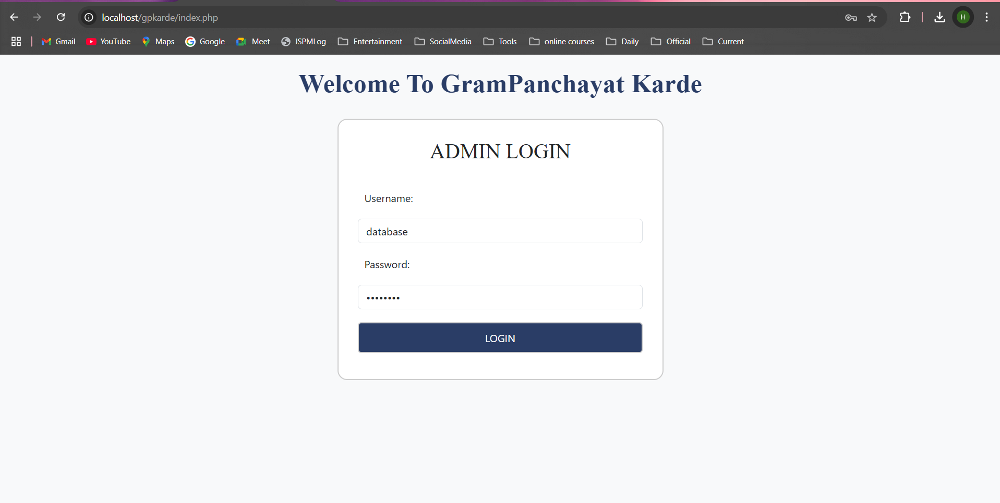
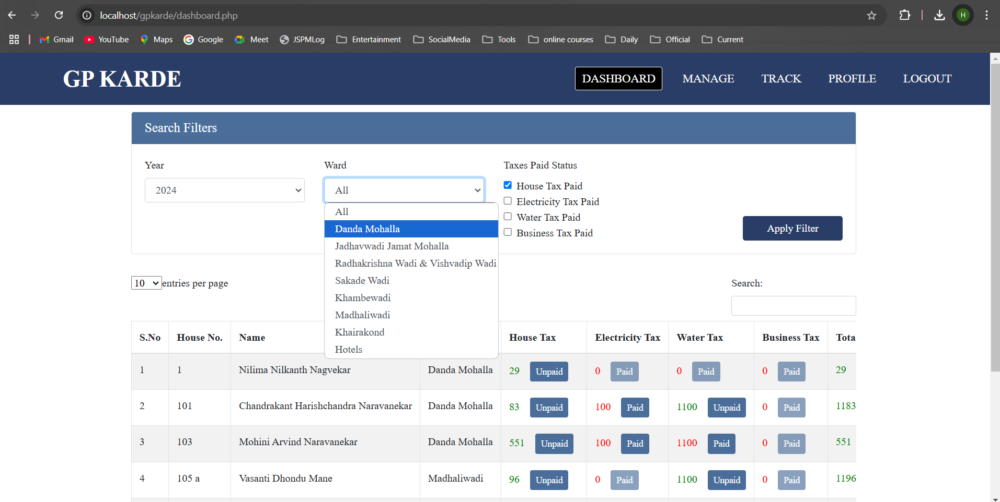
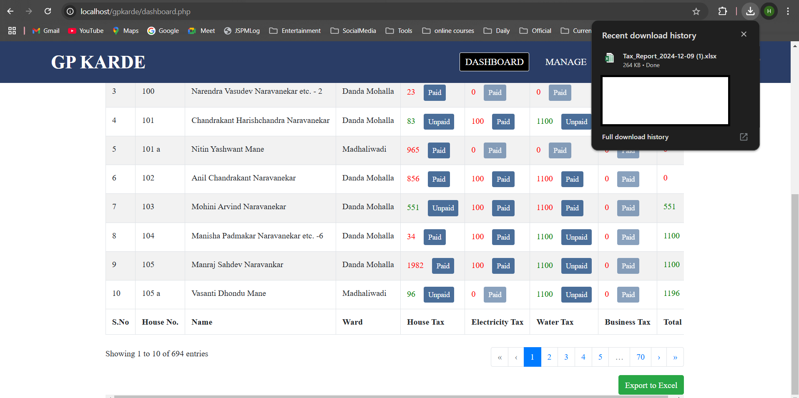
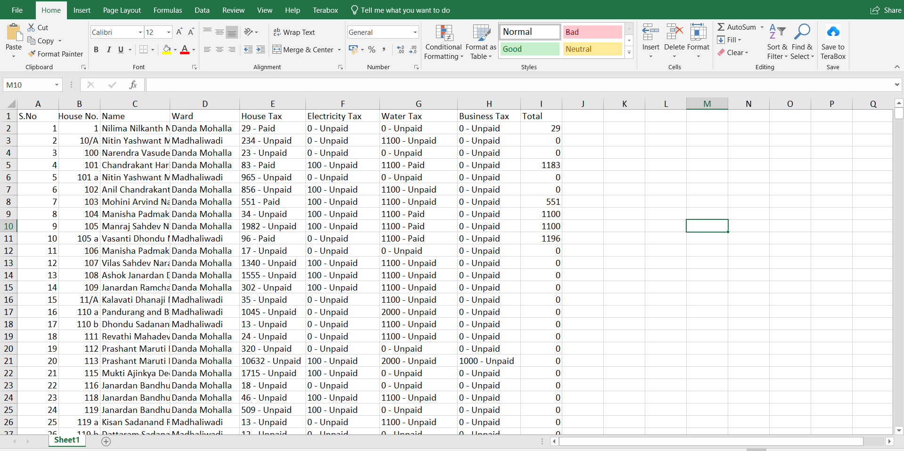
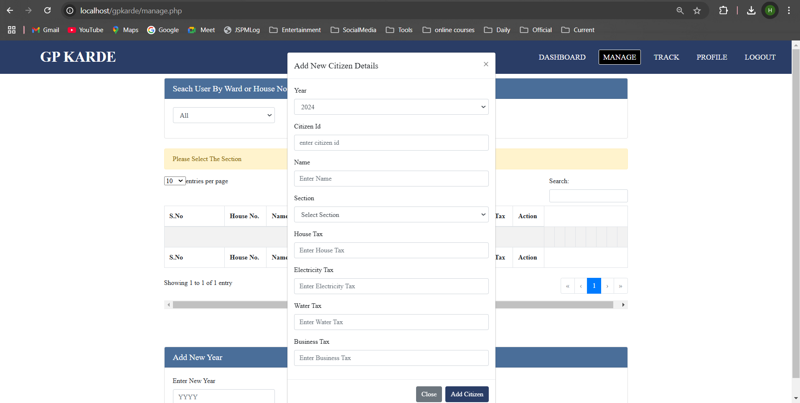
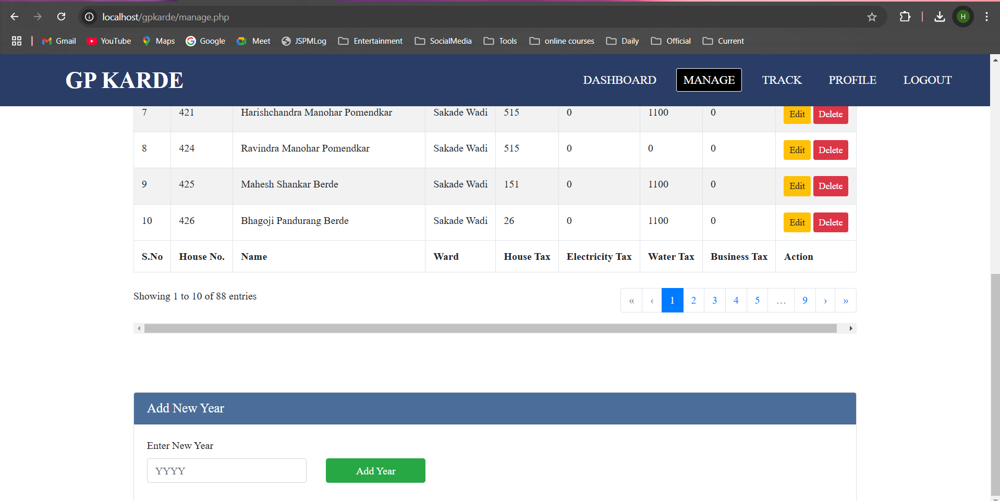
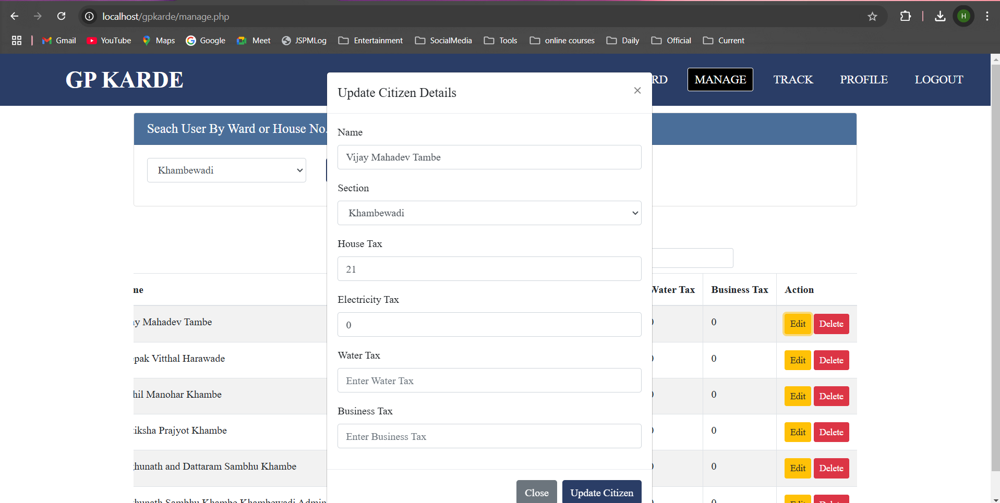
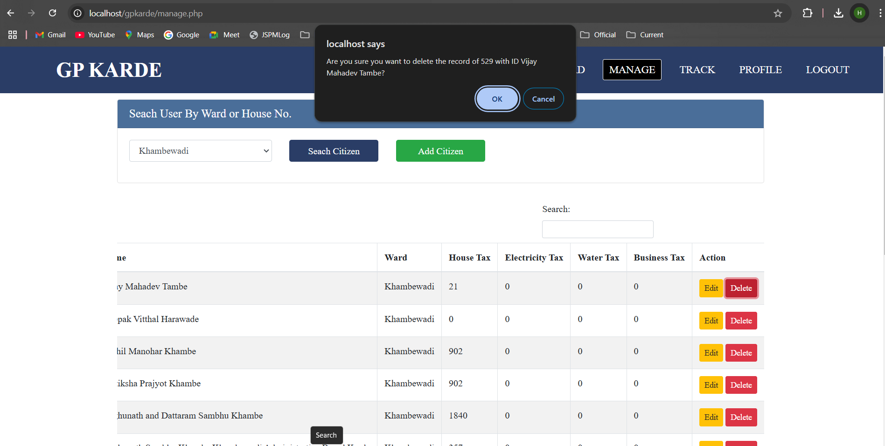
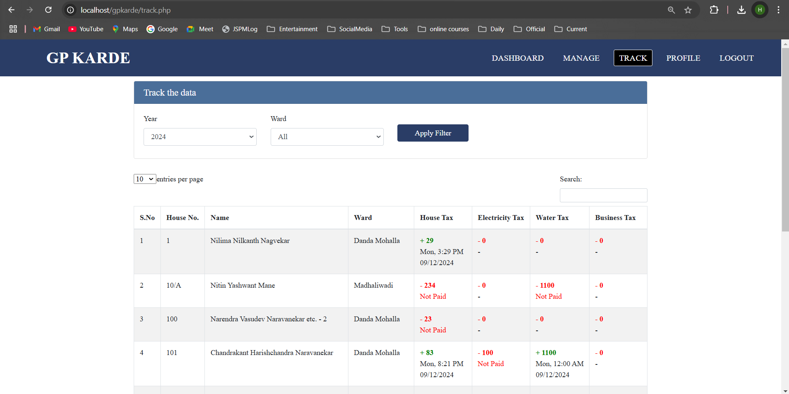
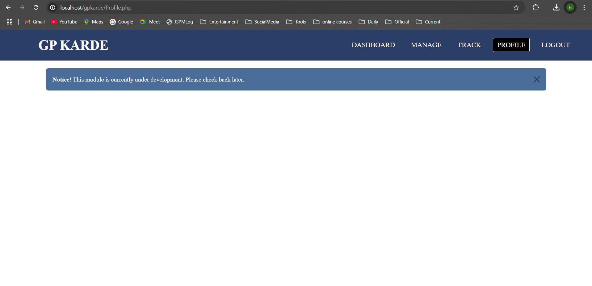

# Title:  Grampanchayat Tax Management System  

## Overview  
In an age of technological advancement, many Grampanchayats continue to rely on traditional, manual methods for managing tax collection. 
This approach involves pen-and-paper record-keeping, which is time-consuming, prone to errors, and difficult to maintain or analyze over time.  

This project addresses the issue faced by the employees of **Karde Grampanchayat**, who requested an automated system to streamline their tax collection 
and management processes. The result is the **Grampanchayat Tax Management System** a user-friendly website designed to meet their requirements of streamline 
tax management, improve efficiency, and provide easy tracking and reporting capabilities.

---

## Key Features  

### **Admin Modules**  

#### 1. **Dashboard**  
   - **Tax Status**: Update paid and unpaid taxes.  
   - **Search and Filter**: Locate citizen records using customizable parameters.  
   - **Export Reports**: Generate and download detailed, customized tax reports for analysis and documentation.  

#### 2. **Manage Citizen Records**  
   - **Search and Edit Data**: Update citizen information, such as name, ward, tax amounts and other.  
   - **Add New Citizens**: Seamlessly register new citizens into the system.  
   - **Delete Records**: Remove outdated or incorrect citizen records.  
   - **Manage Fiscal Years**: Add and organize data for new tax years to ensure accurate record-keeping.  

#### 3. **Tracking**  
   - Track payment histories to identify when taxes were paid, simplifying follow-ups and audits.  

#### 4. **Profile Settings**  
   - Future-proof functionality to incorporate new features as required.  

#### 5. **Logout**  
   - Secure logout mechanism to maintain data security and prevent unauthorized access.  

---

## Why This Project?  
This project not only automates tax collection but also fosters transparency and accountability. 
The system significantly reduces administrative overhead while ensuring data integrity and accessibility.  

Key advantages include:  
- **Time Efficiency**: Automation reduces manual effort and speeds up processes.  
- **Error Reduction**: Centralized, digitized records minimize mistakes.  
- **Ease of Access**: Tax records are easily searchable and retrievable.  
- **Improved Reporting**: Exportable reports aid in decision-making and audits.  

---

## Technical Specifications  

### **Hardware Requirements**  
This project is hosted on a free hosting platform and requires no specific hardware investments.  

 - Server
 - networking equipment
 - user devices (e.g., computers, smartphones).

### **Software Stack**  
- **Frontend:**  
  - HTML  
  - CSS  
  - JavaScript  
  - Bootstrap (for responsive and modern design)  

- **Backend:**  
  - PHP (server-side scripting for functionality and logic)  

- **Database:**  
  - MySQL (for storing and managing tax and citizen data)  

---

## Setup Instructions  

1. **Clone the Repository**  
   ```bash
   git clone <[repository-url](https://github.com/HaridasKhambe/Grampanchayat-Tax-Management-System.git)>
   ```
2. **Deploy the Project**  
   - Host the files on a PHP-supported hosting platform or on the Localhost/apache tomcat.  

3. **Database Configuration**  
   - Import the provided SQL file into a MySQL database.  
   - Update database connection details in the partials/dbconn.php file.  

4. **Access the Application**  
   - Open the website in a web browser using the hosting platform's URL.  

---

## Future Enhancements  

The system is designed with scalability in mind. Planned improvements include:  
- Integration of online payment gateways for tax payments.  
- Notifications and reminders for due or overdue taxes (via SMS or email).  
- Multi-language support for ease of use in rural areas.  
- Enhanced analytics and visualization for better decision-making.  

---

## Acknowledgments  

Special thanks to the **Sandesh Rewale** and other **Karde Grampanchayat employees** for giving me this opportunity to find the solution to this problem and inspiring the development of this system.  

## Related images 

1. Login 


3. Dashboard
    
   
   

5. Manage
    
   
    
   
   

7. Track
    
   

9. Profile
     


## While Grampanchayt karde's Employee Using System:
 
 
 
